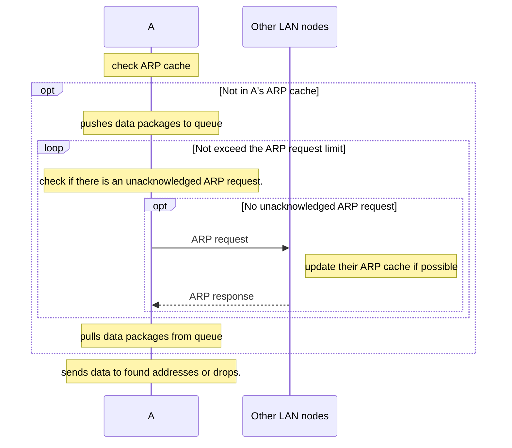

# Address Resolution Protocol (ARP)
<pre>📖 ARP is a solution to find corresponding LAN (MAC) addresses of one or more network interfaces from an IP.</pre>

```mermaid
sequenceDiagram
participant A
participant Other LAN nodes
Note over A: check ARP cache
opt Not in A's ARP cache
  Note over A: pushes data packages to queue
  loop Not exceed the ARP request limit
    Note over A: check if there is an unacknowledged ARP request.
    opt No unacknowledged ARP request
      A ->> Other LAN nodes: ARP request
      Note right of Other LAN nodes: update their ARP cache if possible
      Other LAN nodes -->> A: ARP response
    end
  end
  Note over A: pulls data packages from queue
end
Note over A: sends data to found addresses or drops.

```
