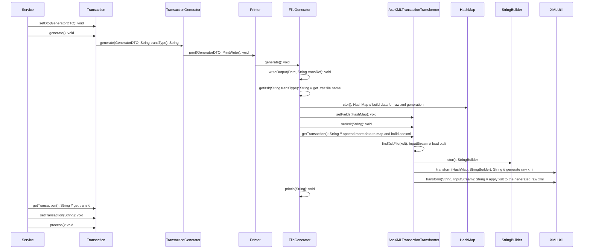

# Shakeout
## Step and steps chain
- Chain 1-5
- Chain 6-7
- Chain 8-9
- Chain 10
- Chain 11-12
- Chain 13-19
- Chain 20
- Chain ..
- Chain 31

Chain 1 -> 5
Chan 11 -> 12
Step 13 -> 15
Step 16 -> 18

Essential Energy LNSP role
-> outbound

Inbound from NEMMCO

CR1000 New customer
CR2000 Site 

Greenfield

2001 premise data

