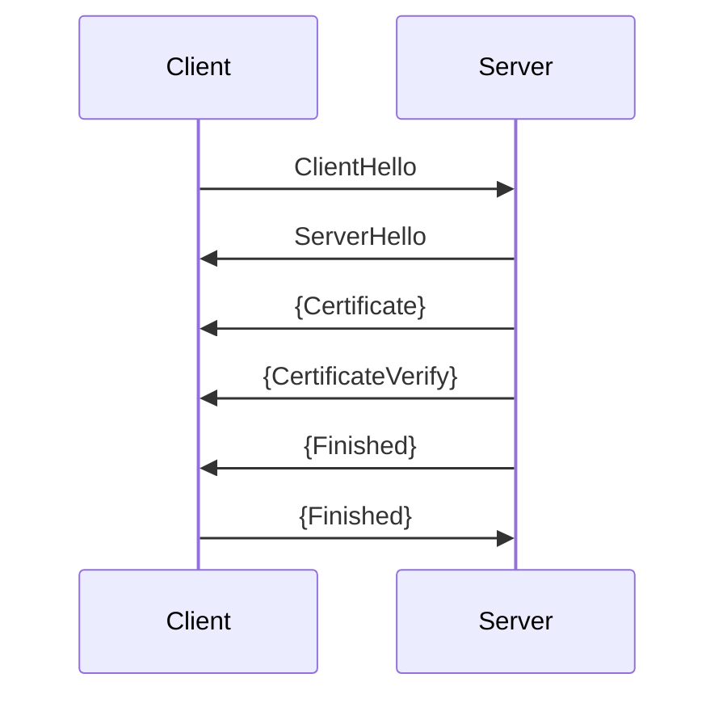

# TLS (Transport Layer Security Protocol)
*TLS is an application-layer protocol (OSI 7th-layer) that runs on top of a reliable and sequential transport protocol and provides security (i.e., authenticated parties, confidential data, and data integrity) for communication between two endpoints. TLS splits its functionalities into two major sub-protocols, the handshake and record protocols. The handshake protocol authenticates parties and helps them decide the cryptography algorithm and shared secret key, while the record protocol protects the transferred data.*
## Version
- 1.2 (Obsoleted)
- 1.3 (Current)
## Record protocol
The record protocol responds to secure data (e.g., encryption and decryption) and data transmission, including fragmentation. Data is in the form of records, and there are two record types, the TLSPlaintext and TLSCiphertext (i.e., contains encrypted data).
### TLSPlaintext record
#### Structure
```
content_type = 2-byte_content_type_code,
legacy_record_version = 0x0303,
content_length = 4-byte,
content
```
#### TLS record content types
| Content type       | Code |
|--------------------|------|
| invalid            | 0x00 |
| change_cipher_spec | 0xF4 |
| alert              | 0xF5 |
| handshake          | 0xF6 |
| application_data   | 0xF7 |

### TLSCiphertext record
#### Structure
```
content_type = 0xF7,
legacy_record_version = 0x0303,
content_length = 4-byte,
encrypted_content
```
## Handshake protocol
The handshake protocol responds to shared-key exchange, cypher options, and parties authentication.
### Common flow (without extensions and client-authentication)
*In the TLS context, the endpoint that starts the connection is called the client, and the other is the server.*

*`{...}` means data was encrypted. Indeed, once the server replies ClientHello with a ServerHello, all later messages are encrypted.*
## Handshake messages
### General message structure
```
handshake_message_type = 1-byte
message_length = 3-byte
message_content
```
### ClientHello (0x01) message
#### Structure
```
legacy_protocol_version = 0x0303,
random = 32-byte_secure_random_number,
legacy_session_id = 32-byte_value | 32-0x00,
cipher_suites = 2-byte_cipher_suits_length supported_TLS_AEAD_HASH_cipher_suites_list,
legacy_compression_methods = 0x00,
extensions = 2-byte_extentions_length extension_contents_list
```
#### Cipher suites
| Cipher suite                 | Code   |
|------------------------------|--------|
| TLS_AES_128_GCM_SHA256       | 0x1301 |
| TLS_AES_256_GCM_SHA384       | 0x1302 |
| TLS_CHACHA20_POLY1305_SHA256 | 0x1303 |
| TLS_AES_128_CCM_SHA256       | 0x1304 |
| TLS_AES_128_CCM_8_SHA256     | 0x1305 |
#### Extension content structure
```
extension_type = 2-byte
extension_data
```
#### Extension types
| Extension type                         | Code   |
|----------------------------------------|--------|
| server_name                            | 0x0000 |
| max_fragment_length                    | 0x0001 |
| status_request                         | 0x0005 |
| supported_groups                       | 0x000a |
| signature_algorithms                   | 0x000d |
| use_srtp                               | 0x000e |
| heart_beat                             | 0x000f |
| application_layer_protocol_negotiation | 0x0010 |
| signed_certificate_timestamp           | 0x0012 |
| client_certificate_type                | 0x0013 |
| server_certificate_type                | 0x0014 |
| padding                                | 0x0015 |
| RESERVED                               | 0x0028 |
| pre_shared_key                         | 0x0029 |
| early_data                             | 0x002A |
| supported_versions                     | 0x002B |
| cookie                                 | 0x002C |
| psk_key_exchange_modes                 | 0x002D |
| RESERVED                               | 0x002E |
| certificate_authorities                | 0x002F |
| oid_filters                            | 0x0030 |
| post_handshake_auth                    | 0x0031 |
| signature_algorithm_cert               | 0x0032 |
| key_share                              | 0x0033 |

### ServerHello (0x02) content
```
legacy_protocol_version = 0x0303,
random = 32-byte_secure_random_number,
client_legacy_session_id,
cipher_suite = 2-byte_cipher_suite_code,
legacy_compression_methods = 0x00,
extensions = 2-byte_extentions_length extension_contents_list
```
## References
[Rescorla, E. (2018). *The Transport Layer Security Protocol Version 1.3*. IETF.](https://datatracker.ietf.org/doc/html/rfc8446)