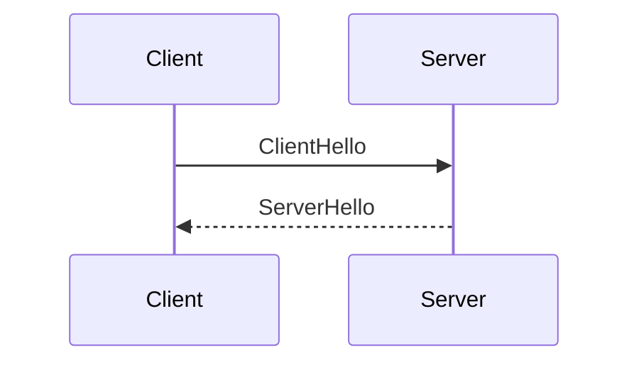

# TLS (Transport Layer Security Protocol)
*TLS is a protocol that runs on top of a reliable and sequential transport protocol and provides security (i.e., authenticated parties, confidential data, and data integrity) for communication between two endpoints. TLS splits its functionalities into two major sub-protocols, the handshake and record protocols. The handshake protocol authenticates parties and helps them decide the cryptography algorithm and shared secret key, while the record protocol protects the transferred data.*
## Version
- 1.2 (Obsoleted)
- 1.3 (Current)
## Flow
*In the TLS context, the endpoint that starts the connection is called the client, and the other is the server.*
### Simple handshake

## References
[Rescorla, E. (2018). *The Transport Layer Security Protocol Version 1.3*. IETF.](https://datatracker.ietf.org/doc/html/rfc8446)