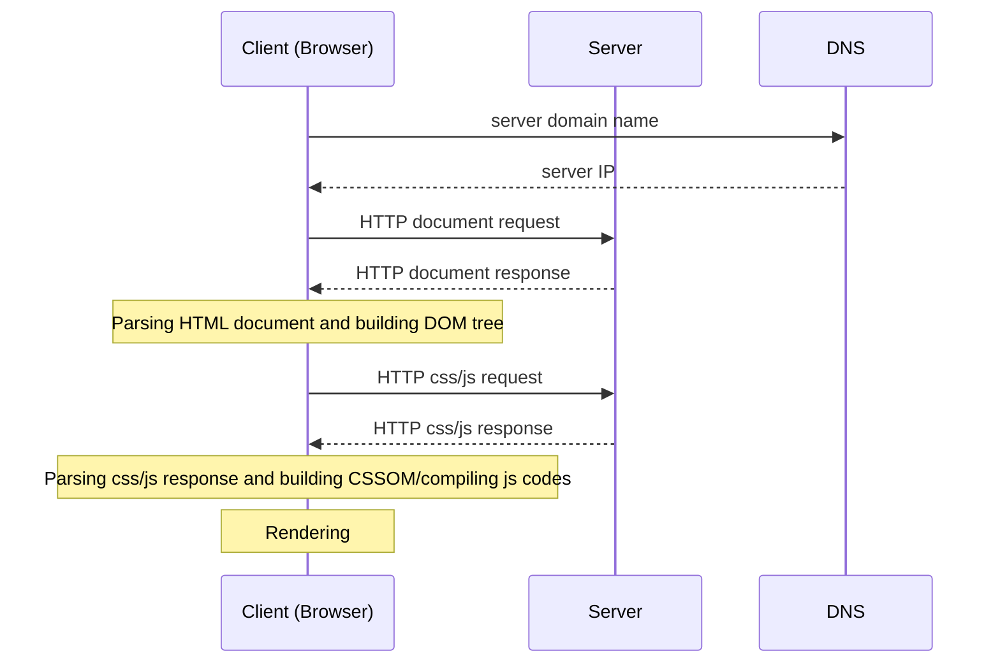

# Web Programming
Web programming is closely related to the Internet and Web (sites and pages). While the [Internet](/network/internet.md) is the infrastructure, the Web is the most common service built on top of it to share information.
- [History of web](#history-of-web-www-or-world-wide-web)
- [How the web works?](#how-the-web-works)
- [Browser](#browser)
- [Why we separate the web content into HTML, CSS, and JavaScript files?](#why-we-separate-the-web-content-into-html-css-and-javascript-files)
## History of web (WWW or World Wide Web)
- Early 1990s: University of Minnesota developed Gopher, a document-sharing system, and it's used in the campus. At the same time, Tim Berners-Lee, a researcher of European Council for Nuclear Research (CERN), created the same thing.
- 1993: Gopher became commercially and CERN published WorldWideWeb source codes.
- Lately 1993, Mosaic browser appeared on Unix, Macintosh, and Windows.
- December 1994, Marc Andreessen and Jim Clark founded Mosaic Communications (Netscape Communication Corporation) and released Netscape Navigator browser. At this time, Tim Berners-Lee founded the World Wide Web Consortium (W3C) at MIT (Massachusetts Institute of Technology), with support from CERN, DARPA, and the European Commission.
- 1998, HTML4 was introduced.
- 2007, HTML Working Group started adopting Web Applications 1.0 specification, namely HTML5.
## How the web works?
Web works based on the client server model (architecture) with:
- Network connection
- [DNS (Domain Name Server)](/network/protocol/routing/dns.md)
- [HTTP (HyperText Transfer Protocol)](/network/protocol/file/http.md)
- Public assets:
  - [HTML (HyperText Markup Language)](/programming/web/html.md) documents
  - [CSS (Cascading StyleSheets)](/programming/web/css.md) files
  - [js (JavaScript)](/programming/lang/js/README.md) files
  - Images, audios, videos, etc.

## Browser
A browser is a (software) application we need to surf websites. It resolves the site location and download, parse, and render the web content. Some well-known browsers are Google Chrome, Safari, Microsoft Edge, and Mozilla Firefox. If you are an advanced user and care about your privacy, [Tor](https://www.torproject.org/) may be what you need.
## Why we separate the web content into HTML, CSS, and JavaScript files?
Since HTML, CSS, and JavaScript are for static content, style (e.g., formatting and layout), and dynamic content, respectively. It's all about a practice of the loosely coupling principle: 
  - Code reuse and easy maintenance.
  - Decrease download size and enable caching.
  - Multiple views of the same content for different purposes, devices, etc.