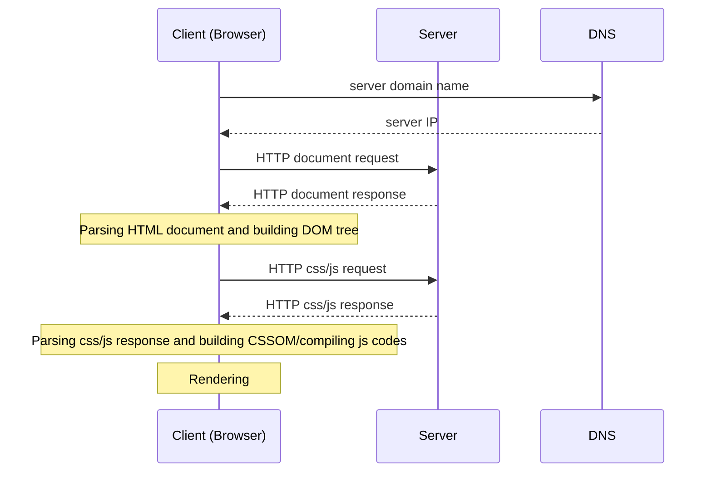

# Web Programming
Web programming is closely related to the Internet and Web (sites and pages). While the [Internet](/network/internet.md) is the infrastructure, the Web is the most common service built on top of it to share information.
- [History of web](#history-of-web-www-or-world-wide-web)
- [How the web works?](#how-the-web-works)
  - [Browser](#browser)
- [Why we separate the web content into HTML, CSS, and JavaScript files?](#why-we-separate-the-web-content-into-html-css-and-javascript-files)
- [Web development process](#web-development-process)
  - [Analysis](#analysis)
  - [Design](#design)
  - [Implementation](#implementation)
  - [Testing](#testing)
  - [Deployment](#deployment)
  - [Maintenance](#maintenance)
## History of web (WWW or World Wide Web)
- Early 1990s: University of Minnesota developed Gopher, a document-sharing system, and it's used in the campus. At the same time, Tim Berners-Lee, a researcher of European Council for Nuclear Research (CERN), created the same thing.
- 1993: Gopher became commercially and CERN published WorldWideWeb source codes.
- Lately 1993, Mosaic browser appeared on Unix, Macintosh, and Windows.
- December 1994, Marc Andreessen and Jim Clark founded Mosaic Communications (Netscape Communication Corporation) and released Netscape Navigator browser. At this time, Tim Berners-Lee founded the World Wide Web Consortium (W3C) at MIT (Massachusetts Institute of Technology), with support from CERN, DARPA, and the European Commission.
- 1998, HTML4 was introduced.
- 2007, HTML Working Group started adopting Web Applications 1.0 specification, namely HTML5.
## How the web works?
Web works based on the client server model (architecture) with:
- Network connection
- [DNS (Domain Name Server)](/network/protocol/routing/dns.md)
- [HTTP (HyperText Transfer Protocol)](/network/protocol/file/http.md)
- Public assets:
  - [HTML (HyperText Markup Language)](/language/formative/markup/html/README.md) documents
  - [CSS (Cascading StyleSheets)](/language/formative/stylesheet/css.md) files
  - [js (JavaScript)](/language/formative/programming/js/README.md) files
  - Images, audios, videos, etc.

### Browser
A browser is a (software) application we need to surf websites. It resolves the site location and download, parse, and render the web content. Some well-known browsers are Google Chrome, Safari, Microsoft Edge, and Mozilla Firefox. If you are an advanced user and care about your privacy, [Tor](https://www.torproject.org/) may be what you need.
## Why we separate the web content into HTML, CSS, and JavaScript files?
Since HTML, CSS, and JavaScript are for static content, style (e.g., formatting and layout), and dynamic content, respectively. It's all about a practice of the loosely coupling principle: 
  - Code reuse and easy maintenance.
  - Decrease download size and enable caching.
  - Multiple views of the same content for different purposes, devices, etc.
## Web accessibility
Everyone should be able to use web equally, especially people with disabilities. Our sites should support web accessibility as much as we can. There are some good sources for this:
- Web Content Accessibility Guidelines (WCAG, aka ISO 405000).
- Authoring Tool Accessibility Guidelines (ATAG).
- User Agent Accessibility Guidelines (UAAG).
- [W3C Web Accessibility Initiative](https://w3.org/wai)
## Web development process
Since web development is software development, so the basic process is in order:
- [Analysis](#analysis)
- [Design](#design)
- [Implementation](#implementation)
- [Testing](#testing)
- [Deployment](#deployment)
- [Maintenance](#maintenance)
### Analysis
In this phrase, we need to
- Break down clearly the purpose of our site/application into:
  - Functionalities
  - Users
  - Use-cases

and their relationships.
- Identify our project design principles (with priority): these principles will/may help us to define the project scopes, solve the conflicts, and find most appropriate solutions.

*The output can be the requirement specification with functional requirements, non-functional requirements, use-case diagrams.*
### Design
Based on the output of the analysis phrase, we can work on:

- Data entities and their state (changing) flows if any

*The output can be data conceptual and data state diagrams.*

- Defining the site structure:
  - How many pages should we have?
  - The navigation between our pages

*The output can be a sitemap, and any presentable navigations (e.g., a mockup, hand-writing papers, or an MS PowerPoint slides).*

- The relationships between our data and pages.
- Identifying (UI and server-side) components
  - Components of each page.
  - Common components (base classes, navigation menu, footer, etc.).

*The output can be component, class, and sequential diagrams.*

- Determining libraries and frameworks (and server-side languages) we will use if any.
- Determining resources consumption and deployment environments.

*The output can be the system and deployment architecture diagrams and development, deployment, and cost plans.*
### Implementation
### Testing
#### Functional testing
#### Device compatability testing
- Run validation tools
  - [W3 Markup Validation Service](https://validator.w3.org)
  - [W3 CSS Validation Service](https://jigsaw.w3.org/css-validator/)
- Run on different browsers and devices, or at least in different modes of the Responsive design mode.
#### Accessibility testing
- Disable javascript and images
  - Firefox: type `about:config` in the Address bar, then changing `permissions.default.image` to `2` and `javascript.enabled` to `false`.
### Deployment
### Maintenance