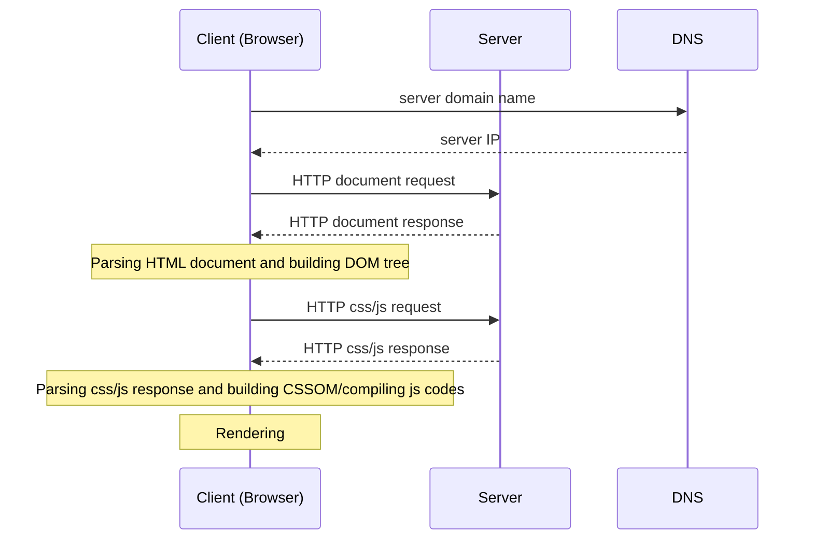

# Web Programming
- [History of web and Internet (Interconnected network)](#history-of-web-and-internet-interconnected-network)
  - [History of Internet](#history-of-internet)
  - [History of web](#history-of-web-www-or-world-wide-web)
- [How the web works?](#how-the-web-works)
## History of web and Internet (Interconnected network)
### History of Internet
- 1960: Joseph Licklider published his idea of an interconnected network.
- 1962: Joseph Licklider formed a research group.
- 1969: four-computer network was introduced.
- 1974: Robert Kahn (ARPA) and Vinton Cerf (Stanford University) published Internet Transmission Control draft 
specification.
- 1977: a demonstration of an interconnected network of three different networks.
- 1981: TCP/IP specification was finalised.
- 1982: Internet arrives.
### History of web (WWW or World Wide Web)
- Early 1990s: University of Minnesota developed Gopher, a document-sharing system, and it's used in the campus. At the 
same time, Tim Berners-Lee, a researcher of European Council for Nuclear Research (CERN), created the same thing.
- 1993: Gopher became commercially and CERN published WorldWideWeb source codes.
- Lately 1993, Mosaic browser appeared on Unix, Macintosh, and Windows.
- December 1994, Marc Andreessen and Jim Clark founded Mosaic Communications (Netscape Communication Corporation) and 
released Netscape Navigator browser. At this time, Tim Berners-Lee founded the World Wide Web Consortium (W3C) at MIT 
(Massachusetts Institute of Technology), with support from CERN, DARPA, and the European Commission.
- 1998, HTML4 was introduced.
- 2007, HTML Working Group started adopting Web Applications 1.0 specification, namely HTML5.
## How the web works?
Web works based on the client server model (architecture) with:
- Network connection
- [DNS (Domain Name Server)](/network/protocol/routing/dns.md)
- [HTTP (HyperText Transfer Protocol)](/network/protocol/file/http.md)
- Public assets:
  - HTML (HyperText Markup Language) Document
  - CSS (Cascading StyleSheets)
  - js (JavaScript)
  - Audio, video, etc.
