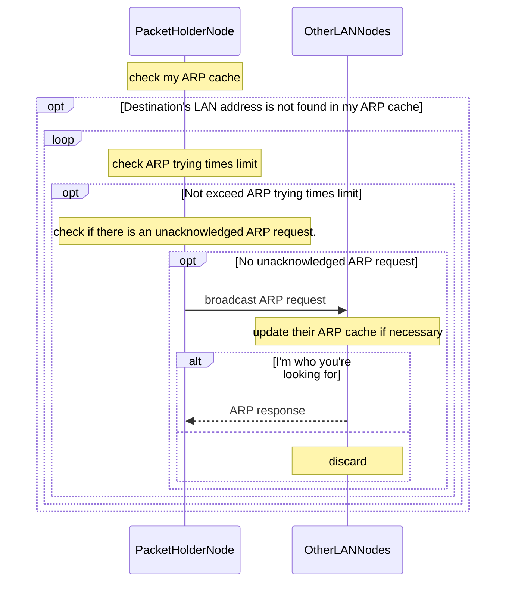

# Address Resolution Protocol (ARP)
```
📖 ARP is a protocol used to find the corresponding LAN address (e.g., Ethernet MAC address) from a protocol address
(e.g., IP address), often by LAN broadcasts.
```
## Workflow

## Other applications
- ARP Failover
- IPv4 Address Conflict Detection (with simple modification)
- Detecting sniffers.
## Commands
#### Show ARP cache
##### Linux
`ip -s neigh`
##### Windows/macOS
`arp -a`
## References
- [Plummer, D. (2012). *An Ethernet Address Resolution Protocol -- or -- Converting Network Protocol Addresses*. Network Working Group.](https://datatracker.ietf.org/doc/html/rfc826)
- [Cheshire, S. (2008). *IPv4 Address Conflict Detection*. Network Working Group.](https://datatracker.ietf.org/doc/html/rfc5227)
- [Dordal, P. L. (2022). *An Introduction to Computer Networks*. Loyola University Chicago.](http://intronetworks.cs.luc.edu/)
