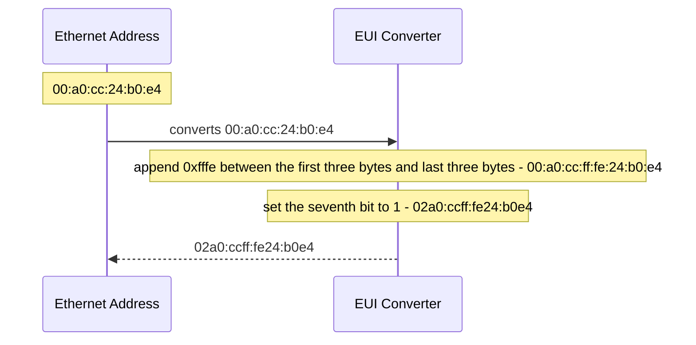

# IPv6
## Header
### Fixed part
40 bytes includes fields:
- `Version`: 4 bits.
- `Traffic class`: 8 bits.
- `Flow label`: 20 bits.
- `Payload length`: 16 bits.
- `Next header`: 8 bits.
- `Hop limit` (analogous IPv4 TTL): 8 bits.
- `Source address`: 128 bits.
- `Destination address`: 128 bits.
### Extension parts (in order)
1. `Hop by hop`
2. `Destination options`
3. `Routing`
4. `Fragment`
5. `Authentication`
6. `Mobility`
7. `Encapsulated Security Payload`
## Address
128 bits.
### Scope
- Link-local (local)
- Global routable (global)
- Multicast
#### Link local
`fe80::/64` (i.e., 0bx1111111010 & 54-bit 0)
```
📖 Link-local addresses are only valid in LAN, and never routed. 
```
### Parts
- Network prefix
- Interface identifier
### Format
#### IPv4 compatability
`::ffff:IPv4`
### Loopback
`::1`
### Modified EUI-64 (EUI - Extended Unique Identifier)
The process converts an Ethernet address to an EUI-64 identifier.

## Facts

```
- LAN broadcast unsupported.
```
## References
- [RFC 2460 - IP version 6 Protocol Specification](https://tools.ietf.org/html/rfc2460.html)
- [RFC 4291 - IP version 6 Addressing Architecture](https://datatracker.ietf.org/doc/html/rfc4291.html)
- [RFC 4007 - IP version 6 Scoped Address Architecture](https://datatracker.ietf.org/doc/html/rfc4007.html)
