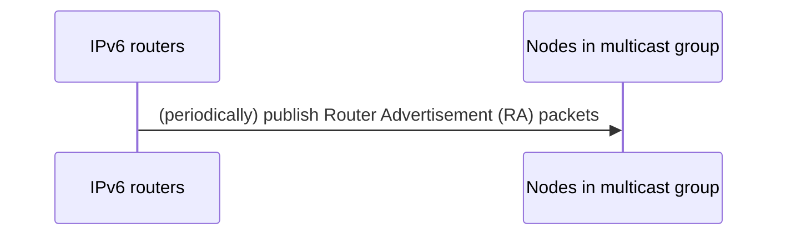
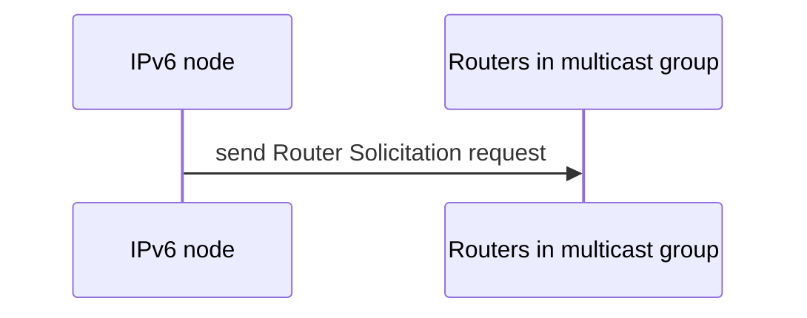
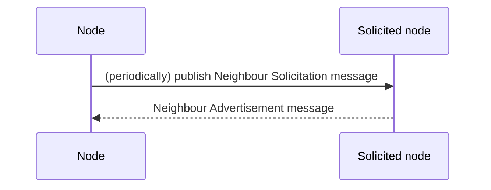
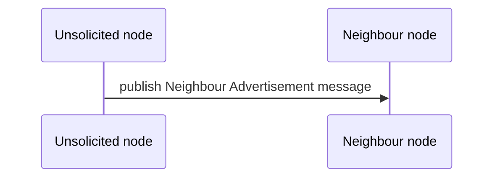

# Neighbour Discovery for IPv6 (ND)
<pre>📖 ND is a protocol for IPv6 same-link nodes to discover each other (including routers) about presence, address,
and reaching path. Indeed, it a combination (with improvements and extensions) of existing protocols such as 
<a href="arp.md">Address Resolution Protocal (ARP)</a> and Internet Control Message Protocol (ICMP).</pre>
## Router discovery
### Ways
#### Pushing by routers

#### Actively requesting

### Messages
#### Router Advertisement
```
📖 A Router Advertisement message contains:
- Router information
- All network prefixes in LAN
- MTU information (optional)
```
#### Router Solicitation
## Neighbour discovery
### Ways
#### Actively periodical requesting

#### Pushing by unsolicited node
*For quickly changes notification*

### Messages
#### Neighbour Solicitation
#### Neighbour Advertisement
## References
- [Narten, T., Nordmark, E., Simpson, W., & Soliman, H. (2007). *Neighbor Discovery for IP version 6 (IPv6)*. Network Working Group.](https://datatracker.ietf.org/doc/html/rfc4861.html)
