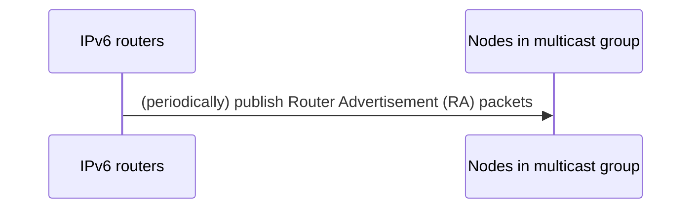
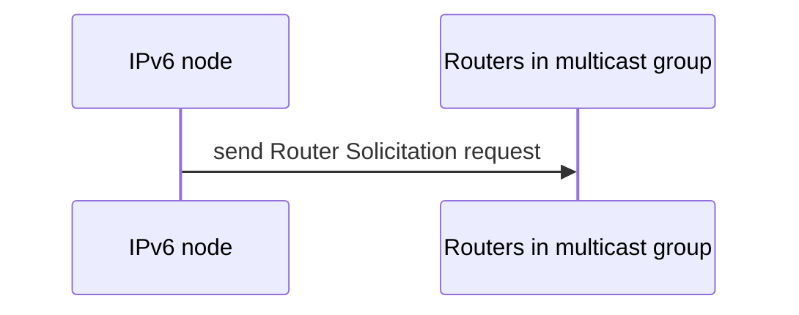
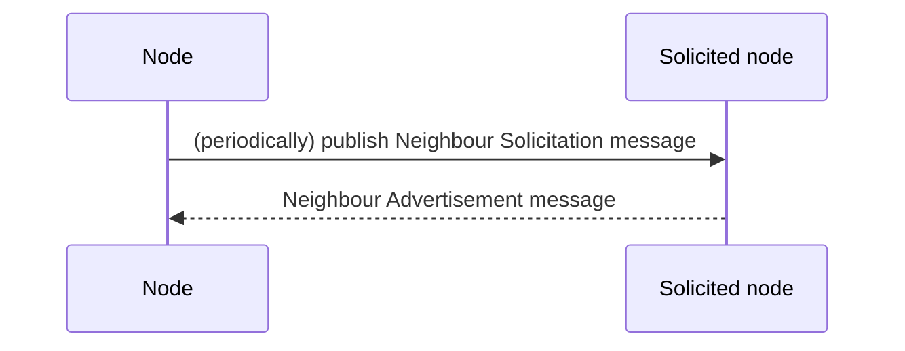
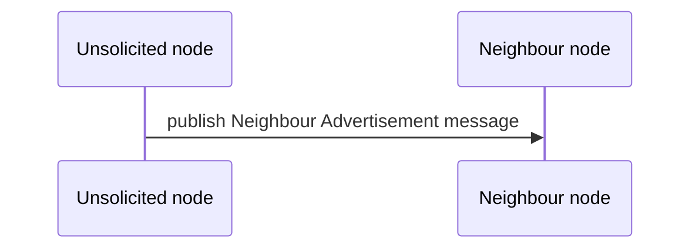

# Neighbour Discovery for IPv6 (ND)
```
📖 ND is a protocol for IPv6 nodes in the same link to discover each other (including routers) about
presence, address, and reaching path.
```
## Router discovery
### Ways
#### Pushing by routers

#### Actively requesting

### Messages
#### Router Advertisement
```
📖 A Router Advertisement message contains:
- Router information
- All network prefixes in LAN
- MTU information (optional)
```
#### Router Solicitation
## Neighbour discovery
### Ways
#### Actively periodical requesting

#### Pushing by unsolicited node
*For quickly changes notification*

### Messages
#### Neighbour Solicitation
#### Neighbour Advertisement
## References
- [RFC 4861 - Neighbour Discovery for IPv6](https://datatracker.ietf.org/doc/html/rfc4861.html)
- [RFC 8504 - IPv6 Node Requirements](https://datatracker.ietf.org/doc/html/rfc8504)
