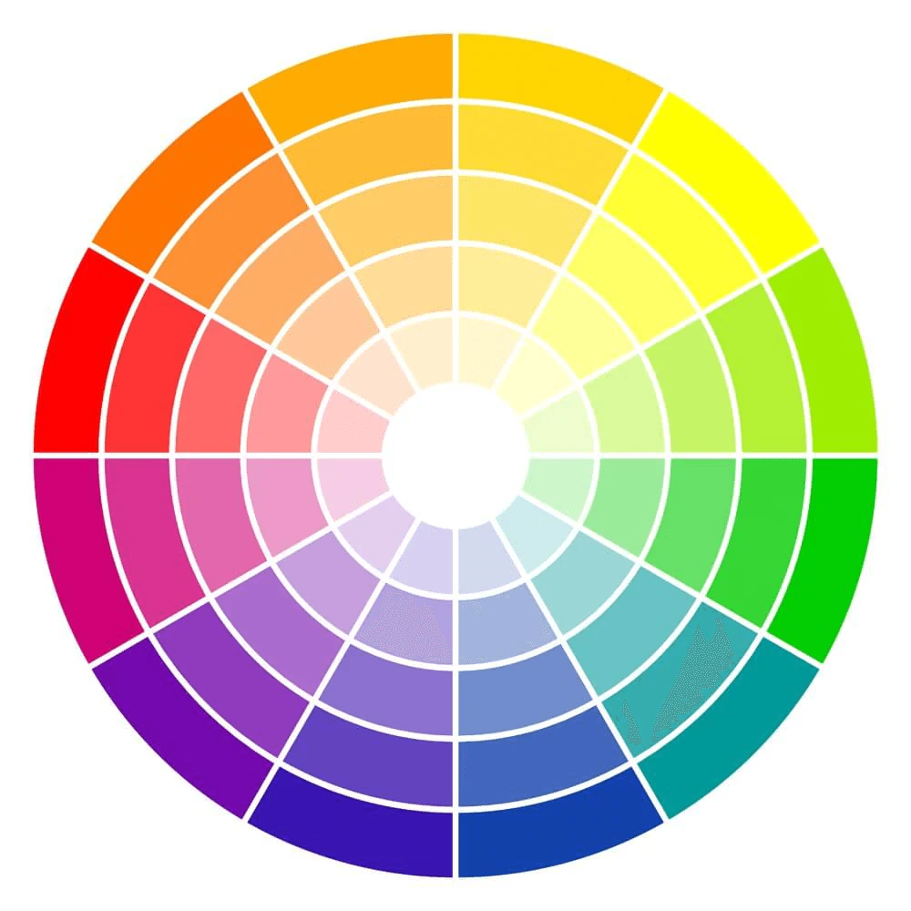

# UI design
## Common Principles
### Audience-Oriented
- Content
  - Clarity: easy to understand and make decision
- Presentation
  - Easy to use: reading, navigation, and searching
### Simplicity
- Content:
  - No redundant
  - Direct to the desired action
- Presentation
  - Colour:
    - The number of colours should be 3-4 (colour combinations).
  - Font:
    - Easy to read
### Consistency
- Content
- Presentation
  - Layout:
    - Symmetry
  - Font
  - Colour palette
### Portability
- Responsive
## Colour
### Colour wheel
A colour wheel is built on primary colours, secondary colours, and tertiary colours.

### Primary colours
- Red: excitement, danger, energy, courage, strength, and anger.
- Blue: freedom, trust, expansiveness, dependability, faith, and inspiration.
- Yellow: sunshine, hope, optimism, light, positive, and freshness.
### Secondary colours
- Purple (Red + Blue): royalty, luxury, power, pride, creativity, and mystery.
- Green (Blue + Yellow): health, nature, renewal, generosity, freshness, and environment.
- Orange (Red + Yellow): creativity, enthusiasm, health, happiness, encouragement, and balance.
### Tertiary colours
- Red-Purple
- Red-Orange
- Blue-Green
- Blue-Purple
- Yellow-Green
- Yellow-Orange
### Hue
Hue is one of primary or secondary colours.
### Colour combinations (schemes)
#### Monochrome (One)
#### Complementary (Two)
#### Analogous (Three or Four)
#### Split complementary (Three)
#### Triadic (Three)
- Choose a main colour in HSB (Hue-Saturation-Brightness) format.
#### Tetradic (Four)
## Font
### Common fonts
- Andale Mono
- Time New Romance
- Georgia
- Verdana
- Arial
- Courier New
- Trebuchet MS
- Comic Sans
- Impact.